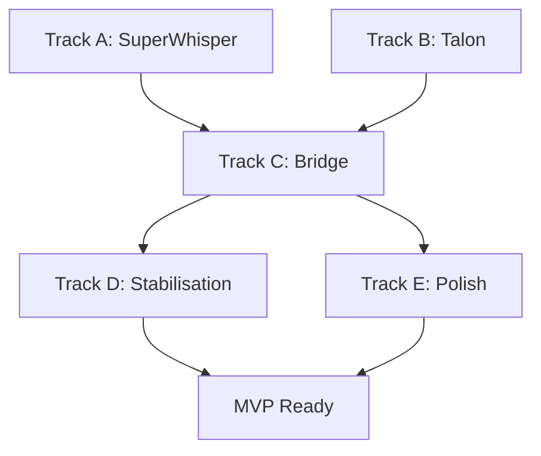

# 🚀 Prism_whisper2 - Sprint Kickoff

**Statut** : 🟢 PRÊT À DÉMARRER  
**Objectif** : MVP fonctionnel en 48h  
**Decision Point** : Assignation des tâches et parallélisation

---

## 📋 Tâches Disponibles - Phase 0 MVP

### 🎯 Tracks Parallélisables (Jour 1 - 8h)

#### **Track A : SuperWhisper Validation** ⏱️ 2h
```
🎯 Objectif : Valider et comprendre la base existante
📍 Localisation : C:\Dev\SuperWhisper\
🛠️ Skills requis : Python, analyse de code, subprocess
```

| ID | Tâche | Durée | Complexité | Prérequis |
|----|-------|-------|------------|-----------|
| **0.A.1** | Extraire StarterKit + test immédiat | 30min | 🟢 Facile | Accès zip |
| **0.A.2** | Créer wrapper Python pour dictee_superwhisper.py | 1h | 🟡 Moyen | Python |
| **0.A.3** | Test subprocess avec capture output | 30min | 🟡 Moyen | subprocess |

**Livrables :**
- [ ] SuperWhisper fonctionne et testé
- [ ] API subprocess documentée
- [ ] Wrapper Python fonctionnel

#### **Track B : Talon Setup** ⏱️ 2h
```
🎯 Objectif : Installer et configurer Talon Voice
📍 Localisation : Installation système + config
🛠️ Skills requis : Installation logiciel, configuration Windows
```

| ID | Tâche | Durée | Complexité | Prérequis |
|----|-------|-------|------------|-----------|
| **0.B.1** | Télécharger/installer Talon Voice | 30min | 🟢 Facile | Admin rights |
| **0.B.2** | Script Win+Shift+V basique | 30min | 🟡 Moyen | Talon syntax |
| **0.B.3** | Test communication Python via socket/file | 1h | 🟡 Moyen | Python + Talon |

**Livrables :**
- [ ] Talon installé et fonctionnel
- [ ] Hotkey Win+Shift+V détecté
- [ ] Communication Python établie

#### **Track C : Bridge Minimal** ⏱️ 4h
```
🎯 Objectif : Créer le pont Talon ↔ SuperWhisper
📍 Localisation : C:\Dev\Superwhisper2\src\
🛠️ Skills requis : Python avancé, IPC, subprocess
⚠️ Dépendance : Requiert A et B complétés
```

| ID | Tâche | Durée | Complexité | Prérequis |
|----|-------|-------|------------|-----------|
| **0.C.1** | Script bridge.py minimal | 1h | 🟡 Moyen | Tracks A+B |
| **0.C.2** | Intégration subprocess → SuperWhisper | 1h | 🟡 Moyen | Track A |
| **0.C.3** | Clipboard + auto-paste via pyautogui | 1h | 🟡 Moyen | Python libs |
| **0.C.4** | Test E2E (Word/Chrome/Teams) | 1h | 🔴 Complexe | Apps installées |

**Livrables :**
- [ ] Bridge fonctionnel Talon→SuperWhisper
- [ ] Auto-paste dans applications
- [ ] Workflow E2E validé

---

## 📋 Tâches Jour 2 (Stabilisation)

### **Track D : Stabilisation** ⏱️ 4h
| ID | Tâche | Durée | Complexité | Prérequis |
|----|-------|-------|------------|-----------|
| **0.D.1** | Error handling basique | 1h | 🟡 Moyen | Track C |
| **0.D.2** | Logging minimal pour debug | 30min | 🟢 Facile | Python |
| **0.D.3** | Script démarrage automatique | 30min | 🟡 Moyen | Windows |
| **0.D.4** | Tests intensifs + fixes bugs | 2h | 🔴 Complexe | Workflow MVP |

### **Track E : Polish Minimal** ⏱️ 4h
| ID | Tâche | Durée | Complexité | Prérequis |
|----|-------|-------|------------|-----------|
| **0.E.1** | Notification Windows simple | 1h | 🟡 Moyen | Windows API |
| **0.E.2** | Icône system tray basique | 1h | 🟡 Moyen | pystray |
| **0.E.3** | Documentation quick start | 1h | 🟢 Facile | Markdown |
| **0.E.4** | Package ZIP portable | 1h | 🟢 Facile | Archive tools |

---

## 🎮 Options de Parallélisation

### Option 1 : Solo Developer 👤
```
Jour 1 :
- Matin : Track A (2h) → Track B (2h) 
- Après-midi : Track C (4h)

Jour 2 :
- Matin : Track D (4h)
- Après-midi : Track E (4h)
```

### Option 2 : Duo Team 👥👥
```
Développeur 1 : Track A + Track C
Développeur 2 : Track B + Track D + Track E

Jour 1 :
- Dev1 : Track A (2h) → Track C partie 1 (2h)
- Dev2 : Track B (2h) → Track C partie 2 (2h)

Jour 2 :
- Dev1 : Track C finition + debug
- Dev2 : Track D + Track E
```

### Option 3 : Team Spécialisée 👥👥👥
```
Développeur Backend : Track A + Track C.1/C.2
Développeur System : Track B + Track D.3 + Track E.2
Développeur Test : Track C.4 + Track D.1/D.4 + Track E.3
```

---

## 🛠️ Environnement de Travail

### Prérequis Techniques
- [ ] **Python 3.11+** installé
- [ ] **Admin rights** Windows pour Talon
- [ ] **RTX 3090** détectée et fonctionnelle
- [ ] **Accès** à `C:\Dev\SuperWhisper\` (lecture)
- [ ] **Espace disque** : 2GB pour extraction

### Outils Nécessaires
- [ ] **IDE** : VSCode/PyCharm configuré
- [ ] **Git** : Pour commits intermédiaires
- [ ] **PowerShell 7** : Pour scripts d'automation
- [ ] **Applications test** : Word, Chrome, Teams installées

### Libraries Python Requises
```bash
pip install pyautogui pyperclip pystray plyer subprocess32
```

---

## 🎯 Décision Points

### 🤔 Questions pour l'Assignation

1. **Combien de développeurs disponibles ?**
   - 1 dev → Option Solo
   - 2 devs → Option Duo  
   - 3+ devs → Option Spécialisée

2. **Qui fait Track A ?** (Analyse SuperWhisper)
   - Développeur avec expérience Python/subprocess
   - Accès confirmé à `C:\Dev\SuperWhisper\`

3. **Qui fait Track B ?** (Talon Setup)
   - Développeur avec droits admin Windows
   - Expérience configuration outils système

4. **Qui fait Track C ?** (Bridge Critical)
   - Développeur Python avancé
   - Disponible après completion A+B

5. **Parallélisation Tracks D+E ?**
   - Même développeur ou séparation ?
   - Priorisation stabilité vs polish ?

### 📊 Contraintes de Séquençage



---

## 🚦 Instructions de Démarrage

### Pour l'Utilisateur - Assignation des Tâches

**Veuillez spécifier :**

1. **Configuration Team :**
   ```
   Développeur 1 : [Tracks assignés]
   Développeur 2 : [Tracks assignés] (si applicable)
   Développeur 3 : [Tracks assignés] (si applicable)
   ```

2. **Ordre de Priorité :**
   ```
   Priorité 1 : [Track X]
   Priorité 2 : [Track Y]  
   Priorité 3 : [Track Z]
   ```

3. **Timing Préféré :**
   ```
   Début immédiat : [Oui/Non]
   Durée session : [Xh par jour]
   Deadline MVP : [Date cible]
   ```

### Exemple d'Assignation
```
ASSIGNATION EXAMPLE :
- Développeur Principal : Tracks A → C → D
- Assistant : Track B → E  
- Parallélisation : Track B pendant Track A
- Début : Immédiat
- Sessions : 4h/jour
- Objectif : MVP en 48h réelles
```

---

## ✅ Checklist Prêt à Démarrer

Avant de commencer, vérifier :

- [ ] **Plan d'assignation** défini par utilisateur
- [ ] **Environnement** prêt (Python, outils, accès)
- [ ] **Tracker** préparé pour mise à jour temps réel
- [ ] **Communication** établie entre développeurs (si team)
- [ ] **Contraintes** bien comprises (pas de modif SuperWhisper)

---

**🎯 EN ATTENTE DE VOS INSTRUCTIONS D'ASSIGNATION**

**Une fois l'assignation définie, je peux démarrer immédiatement le développement selon votre organisation !** 🚀 